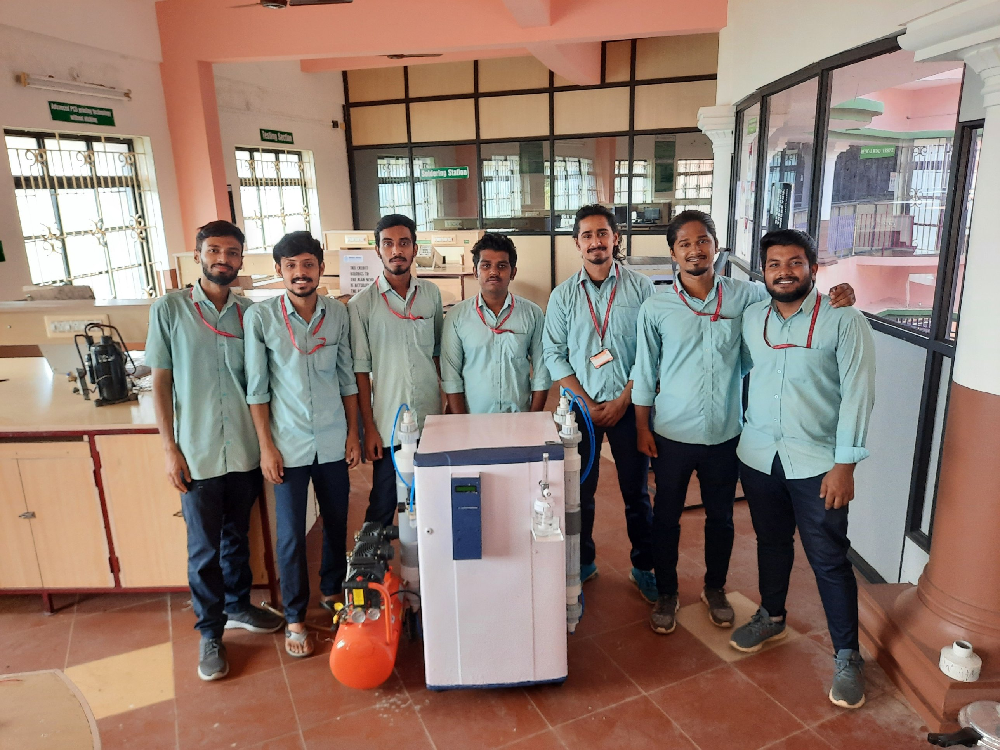
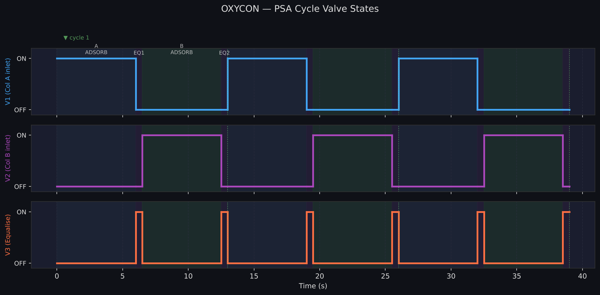
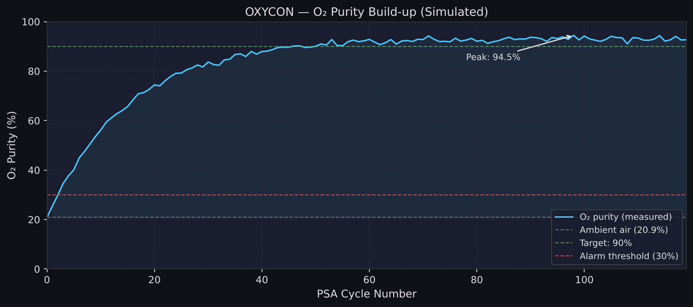
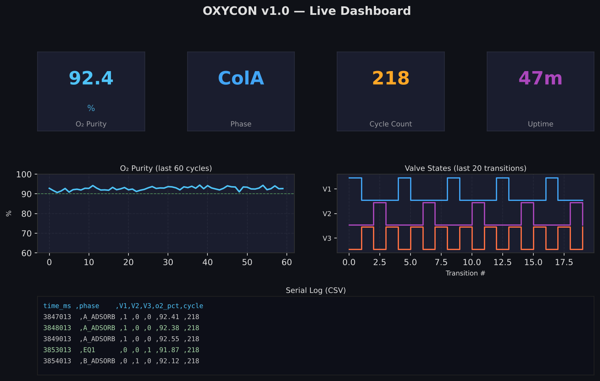

# OXYCON — PSA Oxygen Concentrator Controller

**IIT Bhilai — Department of Mechanical Engineering**  
**Ashish Devadas | Project Engineer**

Arduino-based controller for a 2-column, 3-valve Pressure Swing Adsorption
(PSA) oxygen concentrator. Produces 90–95% O₂-enriched air from ambient air
using zeolite molecular sieves and an off-the-shelf compressor.



---

## Hardware

| Component | Quantity | Purpose |
|-----------|----------|---------|
| Arduino Uno | 1 | Main controller |
| MQ-135 gas sensor | 1 | O₂ purity approximation (via Rs/R0 ratio) |
| 12 V solenoid valve (N.C.) | 3 | V1 (col A inlet), V2 (col B inlet), V3 (equalise) |
| 5 V relay module | 3 | Drive solenoid coils from Arduino logic |
| 16×2 LCD (I2C / PCF8574) | 1 | Live O₂ readout and phase display |
| Zeolite molecular sieve (13X) | 2 × ~500 g | Nitrogen adsorption beds |
| Buzzer (5 V) | 1 | Low-O₂ alarm (optional) |
| Air compressor | 1 | Feed gas (5 LPM rated) |

---

## PSA Cycle

The concentrator runs a 4-phase cycle — two adsorption phases separated by
pressure equalisation steps:

| Phase | V1 | V2 | V3 | Duration |
|-------|:--:|:--:|:--:|---------|
| A_ADSORB — Col A adsorbs N₂ | ON | OFF | OFF | 6 000 ms |
| EQ1 — Pressure equalise | OFF | OFF | ON | 500 ms |
| B_ADSORB — Col B adsorbs N₂ | OFF | ON | OFF | 6 000 ms |
| EQ2 — Pressure equalise | OFF | OFF | ON | 500 ms |

One full cycle = **13 seconds**. V1 and V2 are never open simultaneously.



---

## O₂ Purity Measurement

The MQ-135 is not a true O₂ sensor — it measures CO₂, NH₃, and VOCs. In
the PSA product stream, enriched O₂ contains fewer interfering gases, so
sensor resistance correlates with purity. The firmware maps the Rs/R0 ratio
to O₂% using a linear model:

```
o2 = 20.9 + (1 − Rs/R0) × 95   [%]
```

Run `tools/calibrate_sensor/calibrate_sensor.ino` to determine **R0** for
your specific sensor and update `firmware/OXYCON/config.h`.



> For clinical-grade accuracy, replace the MQ-135 with a dedicated
> electrochemical sensor such as the **KE-25** (Figaro) or **ME2-O2** (Winsen).

---

## Pin Assignments

| Signal | Arduino Pin |
|--------|------------|
| MQ-135 AO | A0 |
| V1 relay (Col A inlet) | D4 |
| V2 relay (Col B inlet) | D5 |
| V3 relay (equalise) | D6 |
| Buzzer | D7 |
| LCD SDA | A4 |
| LCD SCL | A5 |

See `docs/wiring.md` for full schematic and relay wiring details.

---

## Dashboard / Serial Log

The firmware streams CSV data at 9600 baud:

```
time_ms,phase,V1,V2,V3,o2_pct,cycle
3847013,A_ADSORB,1,0,0,92.41,218
3853013,EQ1,0,0,1,91.87,218
3854013,B_ADSORB,0,1,0,92.12,218
```

The LCD shows O₂ purity on line 1 and current phase + cycle count on line 2.



---

## Quick Start

### Flash the firmware

1. Install [Arduino IDE](https://www.arduino.cc/en/software) and add the `LiquidCrystal_I2C` library  
   (`Sketch → Include Library → Manage Libraries → search "LiquidCrystal I2C" by Frank de Brabander`)
2. Open `firmware/OXYCON/OXYCON.ino`
3. Review `firmware/OXYCON/config.h` — edit `ADSORB_MS`, `MQ135_R0`, relay polarity as needed
4. Select **Board: Arduino Uno**, upload

### Calibrate the O₂ sensor

```
1. Open tools/calibrate_sensor/calibrate_sensor.ino in Arduino IDE
2. Upload to the Uno
3. Open Serial Monitor at 9600 baud
4. Wait 60 s warm-up, then read off the averaged R0 value
5. Copy R0 into firmware/OXYCON/config.h → MQ135_R0
6. Re-flash OXYCON.ino
```

### Run the Python tests

```bash
pip install -r requirements.txt
pytest tests/ -v
# 25 tests covering PSA state machine, valve logic, and O2 calculation
```

---

## Repository Layout

```
oxycon/
├── firmware/
│   └── OXYCON/
│       ├── OXYCON.ino          # Main Arduino sketch
│       └── config.h            # All tunable parameters
├── tools/
│   ├── calibrate_sensor/
│   │   └── calibrate_sensor.ino   # MQ-135 R0 calibration sketch
│   └── generate_plots.py       # Generate README media
├── tests/
│   └── test_psa_logic.py       # 25 unit tests (Python mirror of firmware)
├── docs/
│   ├── wiring.md               # Full schematic and relay wiring
│   └── psa_theory.md           # PSA operating principles and tuning guide
├── media/
│   ├── psa_cycle.png           # Valve timing diagram
│   ├── o2_purity.png           # O₂ purity build-up chart
│   └── dashboard_preview.png   # Serial log / LCD preview
├── schematics/                 # KiCad / Fritzing files (add your own)
├── .gitignore
├── requirements.txt
└── README.md
```

---

## Tuning

`config.h` centralises all adjustable parameters. The two most important:

- **`ADSORB_MS`** (default 6000 ms) — Increase if O₂ purity is below 85%;  
  decrease if the zeolite bed saturates before the phase ends.
- **`MQ135_R0`** — Must match your specific sensor; use `calibrate_sensor.ino`.

See `docs/psa_theory.md` for a full tuning guide and PSA operating principles.

---

## Dependencies

| Library | Purpose |
|---------|---------|
| `Wire.h` | I2C (built-in to Arduino IDE) |
| `LiquidCrystal_I2C` | 16×2 LCD driver |

Python (tests only): `pytest >= 7.0`

---

## License

MIT License — free to use and modify with attribution.

---

*Built at IIT Bhilai, Department of Mechanical Engineering, as part of the OXYCON PSA oxygen concentrator project.*
